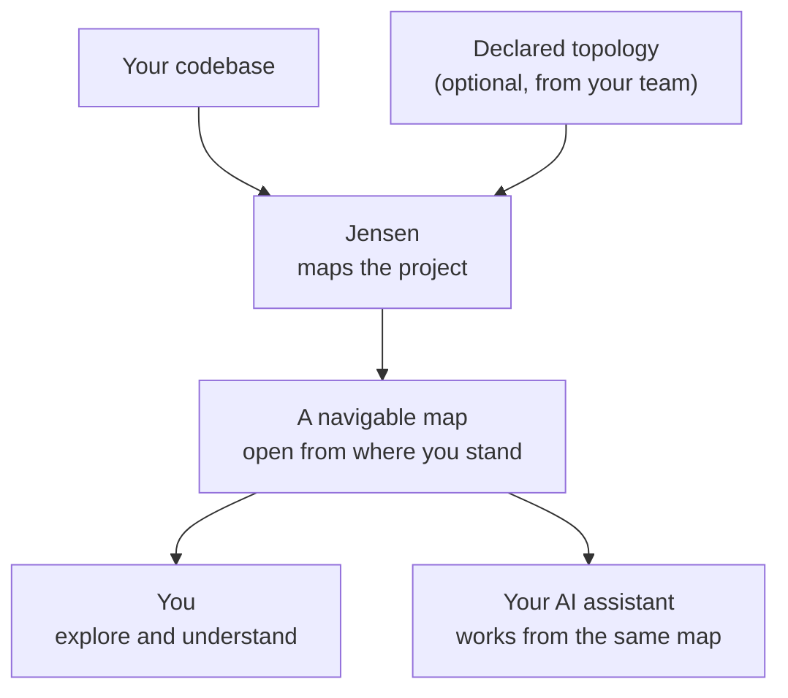

<a name="readme-top"></a>

<br />
<div align="center">
  
  <h3 align="center">Jensen</h3>

  <p align="center">
    An AI-first IDE for large, complex codebases.
    <br />
    Understand the codebase before you change it.
    <br />
    <br />
    <a href="#download">Download</a>
    ·
    <a href="https://jensen-org.github.io/releases/">Documentation</a>
    ·
    <a href="https://github.com/jensen-org/releases/issues">Report a bug</a>
  </p>

  <p align="center">
    <a href="#license"></a>
    
    
  </p>
</div>

## Table of contents

- [What is Jensen](#what-is-jensen)
- [Honest by design](#honest-by-design)
- [How it works](#how-it-works)
- [Download](#download)
- [Install](#install)
- [Verify a download](#verify-a-download)
- [First run](#first-run)
- [Choose an AI assistant](#choose-an-ai-assistant)
- [The git guard](#the-git-guard)
- [Capabilities](#capabilities)
- [CLI reference](#cli-reference)
- [The shared map](#the-shared-map)
- [License](#license)
- [This repository](#this-repository)

<p align="right">(<a href="#readme-top">back to top</a>)</p>

## What is Jensen

**Jensen** is an AI-first IDE built for large, complex codebases. It maps your project into a
navigable picture of how it actually fits together, the services, the calls between them, the
routes they expose, and hands that same map to your AI assistant so you both work from a shared
understanding instead of guessing.

Big multi-service codebases are hard to hold in your head. New to a repo, you spend days tracing
what talks to what. AI assistants make that worse in a specific way: pointed at raw source, they
burn effort re-scanning files and confidently invent an architecture that was never there. Jensen
removes that friction for both of you. You get a map you can open from wherever you stand, and
your assistant gets a compact, trustworthy description of the real structure, so its answers about
the system are faster and correct.

Jensen supplies the context, not the model. It embeds no AI model of its own and works with the
assistant you already use.

<p align="right">(<a href="#readme-top">back to top</a>)</p>

## Honest by design

A map is only worth leaning on if you can trust every line of it. Jensen's core rule is that it
never guesses. Everything it shows you is one of two things, something it observed directly in
your source or something your team declared on purpose, and the two stay distinguishable, each
carrying the evidence behind it. Where Jensen does not know, it says unknown rather than inventing
an answer.

That single guarantee is what makes the map safe for a human to rely on and safe for an AI to
build on. When the map says two services are connected, they are. When it stays silent, that
silence is honest, not a gap papered over with a plausible guess.

<p align="right">(<a href="#readme-top">back to top</a>)</p>

## How it works



Point Jensen at your project and it builds the map from what is really there: services, calls,
routes, files, symbols and project knowledge. If your team wants to describe cross-service
topology that no single repo can show on its own, which services exist and how they connect, you
declare it and Jensen folds it into the same picture. From there you open the map at whatever
altitude you need, the whole system at a glance or one service drilled down to its internals. Your
assistant reads that same map, so you are never explaining the architecture to it from scratch.

<!--
Screenshots. Drop the files at these paths and remove this comment to publish them.

| | |
| --- | --- |
|  |  |
|  |  |
-->

<p align="right">(<a href="#readme-top">back to top</a>)</p>

## Download

Every build is published on this repository's [releases page](https://github.com/jensen-org/releases/releases).

| Platform | Architecture | Asset |
| --- | --- | --- |
| macOS | Apple Silicon | `.dmg` |
| Debian, Ubuntu | x86_64 | `.deb` |
| Fedora, RHEL, openSUSE | x86_64 | `.rpm` |

Beta builds are published as prereleases, so GitHub does not expose them through the `latest`
release URL. Take them from the releases page itself.

Every release also carries `SHA256SUMS`, its detached signature `SHA256SUMS.asc`, and
`release.json` describing the build.

<p align="right">(<a href="#readme-top">back to top</a>)</p>

## Install

On macOS, open the disk image and drag Jensen into your Applications folder. The build is signed
and notarized, so it opens like any other app.

On Debian or Ubuntu:

```bash
sudo apt install ./Jensen_*_amd64.deb
```

On Fedora, RHEL or openSUSE:

```bash
sudo dnf install ./Jensen-*.x86_64.rpm
```

Both put `jensen-desktop` and the `jensen` CLI on your `PATH`, and register the desktop entry the
shell needs to show the app's own icon.

<p align="right">(<a href="#readme-top">back to top</a>)</p>

## Verify a download

Check the file against the published checksums, from the directory you downloaded into:

```bash
shasum -a 256 -c SHA256SUMS   # macOS
sha256sum -c SHA256SUMS       # Linux
```

The checksum file is signed, so you can confirm it came from the release pipeline rather than from
whoever handed you the link:

```bash
gpg --import JENSEN_RELEASE_PUBKEY.asc
gpg --verify SHA256SUMS.asc SHA256SUMS
```

<p align="right">(<a href="#readme-top">back to top</a>)</p>

## First run

Open a project, then turn Jensen on for it. Use Setup in Settings, About, or run this in the
project from a terminal:

```bash
jensen setup
```

One command wires everything. It links `jensen` on your `PATH`, turns Jensen on for the project,
installs the git guard and points the project's hooks at it, registers the context server with
every supported assistant CLI it finds, wires the session and plan hooks, silences assistant
commit bylines, installs the `/jensen-debrief` command, writes the agent conventions into the
project, and indexes it.

The point of all that is that it does not matter where you start. An assistant you launch in a
plain shell gets the same context server, the same tools and the same conventions as one running
inside the app.

Running it again is safe. Every step checks what is already in place and leaves it alone, and it
never touches hooks or binaries it did not install. To see what is wired without changing
anything:

```bash
jensen setup --status
```

Skip indexing, the slow part on a large repo, with `--no-scan`. Run one part with
`--only <step>`, and reverse any of it with `--uninstall`.

Once the command is on your `PATH`, open a project from the terminal the way you would with an
editor. Restart your shell first, or source your profile, so the new link is found.

```bash
jensen .
```

Codex needs a one-time trust review for user-installed command hooks. After setup, start Codex and
use `/hooks` to review and trust the Jensen entries. Claude Code and Gemini CLI pick up their
updated settings on the next session.

Knowledge search runs offline. On first use it tries to fetch a small embedding model to enrich
ranking, and on a machine with no network it falls back to lexical search with no loss of
availability.

<p align="right">(<a href="#readme-top">back to top</a>)</p>

## Choose an AI assistant

Jensen discovers the assistant CLIs already on your machine, Claude Code, Codex, Gemini CLI and
Antigravity, and registers the context server with each of them once at user scope, so you approve
it a single time instead of once per project. Pick the default for new sessions, plans,
implementation runs and AI actions in Settings, AI assistants, or from the terminal:

```bash
jensen assistant list
jensen assistant set codex   # claude, codex, gemini, antigravity, or automatic
```

Automatic selection is deliberately conservative. Jensen chooses for you only when exactly one
assistant is available. When several are configured it asks instead of silently preferring one,
and an explicit choice never falls back to a different provider when its CLI is missing.

Workspace trust is a separate gate. A new repository stays restricted until you approve it. A
restricted workspace can be browsed and edited, but cannot run project commands, local toolchains,
debug adapters or plan acceptance checks. Review or revoke that decision in Settings, Security.

<p align="right">(<a href="#readme-top">back to top</a>)</p>

## The git guard

Setup installs a guard into the project's git hooks, so it fires for every commit however it was
made, from a terminal, an editor, an assistant or another tool. A commit carrying a secret or junk
is refused outright:

```console
$ git commit -m "wip"
jensen: commit blocked, staged changes contain secrets or junk:
  env-file in .env (.env)
Remove them, or accept a finding in Jensen. To bypass once: git commit --no-verify
```

It recognises `.env` files, private keys, provider tokens, dependency and build directories, and
other common leaks. A push that would discard commits the remote already has is refused the same
way. To remove it, run `jensen setup --only git-shim --only git-hooks --uninstall`, which takes
out the guard and unwires this project's hooks from it.

<p align="right">(<a href="#readme-top">back to top</a>)</p>

## Capabilities

| Capability | What it does | Status |
| --- | --- | --- |
| Map a codebase | Builds a navigable graph of the real structure: services, calls between symbols, and the routes they expose. | Available |
| Declare topology | Lets your team assert cross-service structure, which services exist, how they connect, and over what protocol, and merges it into the same map. | Available |
| Open from where you stand | Views the map at any altitude, from the whole-system topology down to a single service's internals, and stays consistent across sessions. | Available |
| Share the map with your AI | Emits a portable, git-friendly, always-honest map any AI assistant can read, so it answers questions about the system faster and more correctly. | Available |
| Ask the map questions | Query the structure directly: what calls this, what connects to that, where these routes live. | In progress |
| Stay live | Keeps the map current as you edit, and pulls in work items and pipeline status from GitHub, GitLab and Slack. | Planned |

<p align="right">(<a href="#readme-top">back to top</a>)</p>

## CLI reference

The `jensen` CLI is one entry point for all of it. Run `jensen` with no arguments for the command
list, and `jensen help <command>` for one command's flags and examples.

| Command | What it does |
| --- | --- |
| `jensen setup [path]` | Turn Jensen on for this machine and project. |
| `jensen setup --status` | Report what is wired. Writes nothing. |
| `jensen <path>`, `jensen open [path]` | Open the app on a directory, the way `code .` does. |
| `jensen assistant` | Inspect or choose the default AI assistant. |
| `jensen view <path>` | Print the file and import graph. |
| `jensen query <path> <q>` | Ask the map a question. |
| `jensen gen <path>` | Write the full map to disk. |
| `jensen watch <path>` | Keep the map current as you edit. |
| `jensen ingest <path> <doc>` | Add a documentation source. |
| `jensen knowledge` | Inspect, compact or export what Jensen knows. |
| `jensen learn` | Record, browse and reuse learned skills. |
| `jensen worktree` | Isolated worktrees for parallel tasks. |
| `jensen bridge <path>` | The context server your assistant connects to. It launches this for you. |
| `jensen doctor` | What is working and what is not. |
| `jensen ping` | Check that the daemon is running. |

<p align="right">(<a href="#readme-top">back to top</a>)</p>

## The shared map

The map is not locked inside the IDE. Jensen writes it out as portable files that live alongside
your code and any AI assistant can read. They are the context your assistant works from, a compact
description of the system instead of the whole repository.

Two properties make those files dependable. They are git-friendly, so the map lives in version
control next to the code it describes and its changes show up in review. And they are
deterministic, the same codebase always produces the same map, so diffs stay clean and honest, and
a change in the map means a real change in the code.

<p align="right">(<a href="#readme-top">back to top</a>)</p>

## License

Jensen is source-available under the
[PolyForm Noncommercial License 1.0.0](https://polyformproject.org/licenses/noncommercial/1.0.0).
You may use, modify and redistribute Jensen for permitted noncommercial purposes. Commercial use,
resale, paid redistribution, hosted offerings, or bundling Jensen into a paid product requires a
separate written license from the copyright holder.

This is not an open-source license. All commercial rights not expressly granted remain reserved.

<p align="right">(<a href="#readme-top">back to top</a>)</p>

## This repository

It publishes every Jensen build, serves the
[documentation](https://jensen-org.github.io/releases/), and holds the source of the download page
for the macOS build. How that page is put together, the ring, the motion, the type and the theme
flip, is written up in [docs/download-page.md](docs/download-page.md).

<p align="right">(<a href="#readme-top">back to top</a>)</p>
