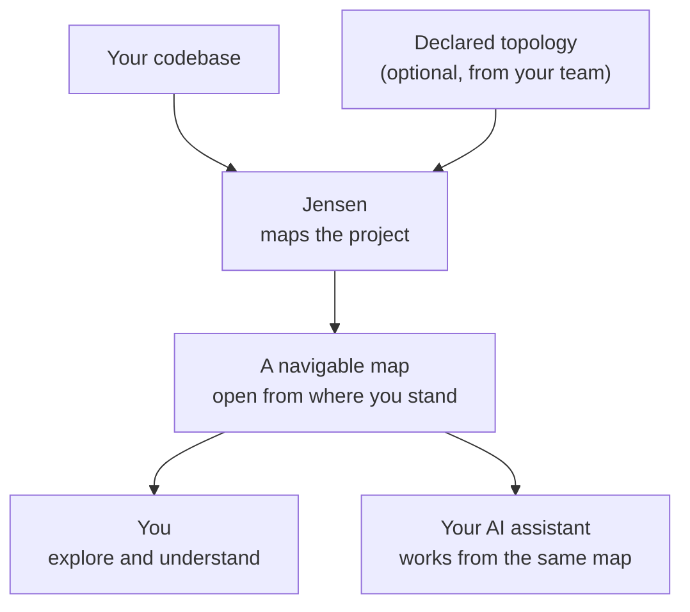

<a name="readme-top"></a>

<br />
<div align="center">
  
  <h3 align="center">Jensen</h3>

  <p align="center">
    An AI-first IDE for large, complex codebases.
    <br />
    Understand the codebase before you change it.
    <br />
    <br />
    <a href="#download">Download</a>
    ·
    <a href="https://jensen-org.github.io/releases/">Documentation</a>
    ·
    <a href="https://github.com/jensen-org/releases/issues">Report a bug</a>
  </p>

  <p align="center">
    <a href="#license"></a>
    
    
  </p>
</div>

## Table of contents

- [What is Jensen](#what-is-jensen)
- [Honest by design](#honest-by-design)
- [How it works](#how-it-works)
- [Download](#download)
- [Install](#install)
- [Verify a download](#verify-a-download)
- [First run](#first-run)
- [Choose an AI assistant](#choose-an-ai-assistant)
- [The git guard](#the-git-guard)
- [Capabilities](#capabilities)
- [The shared map](#the-shared-map)
- [Documentation](#documentation)
- [License](#license)
- [This repository](#this-repository)

<p align="right">(<a href="#readme-top">back to top</a>)</p>

## What is Jensen

**Jensen** is an AI-first IDE built for large, complex codebases. It maps your project into a
navigable picture of how its components fit together, and hands that same map to your AI assistant
so you both work from a shared understanding.

Installing it gives you two things from the same package: a desktop application, and a `jensen`
command. The application is where you read the map, run sessions and approve what an agent asks
for. The command line reaches the same map, the same knowledge and the same guard with the app
closed.

Big multi-service codebases are hard to hold in your head. When you are new to a repo, you spend
days tracing what talks to what. AI assistants make that worse in a specific way: pointed at raw
source, they burn effort re-scanning files and confidently invent an architecture that was never
there. Jensen removes that friction for both of you.

Jensen supplies the context, not the model. It embeds no AI model of its own and works with the
assistant you already use.

<p align="right">(<a href="#readme-top">back to top</a>)</p>

## Honest by design

A map is only worth leaning on if you can trust every line of it. Jensen's core rule is that it
never guesses. Everything it shows you is one of two things, something it observed directly in
your source or something your team declared on purpose, and the two stay distinguishable, each
carrying the evidence behind it. What Jensen does not know is marked unknown until someone tells
it.

That single guarantee is what makes the map safe for a human to rely on and safe for an AI to
build on. When the map says two services are connected, they are.

<p align="right">(<a href="#readme-top">back to top</a>)</p>

## How it works



Point Jensen at your project and it builds the map from what is really there: services, calls,
routes, files, symbols and project knowledge. If your team wants to describe cross-service
topology that no single repo can show on its own, which services exist and how they connect, you
declare it and Jensen folds it into the same picture. From there you open the map at whatever
altitude you need, the whole system at a glance or one service drilled down to its internals. Your
assistant reads that same map, so you are never explaining the architecture to it from scratch.

<!--
Screenshots. Drop the files at these paths and remove this comment to publish them.

| | |
| --- | --- |
|  |  |
|  |  |
-->

<p align="right">(<a href="#readme-top">back to top</a>)</p>

## Download

Every build is published on this repository's [releases page](https://github.com/jensen-org/releases/releases).

| Platform | Architecture | Asset |
| --- | --- | --- |
| macOS | Apple Silicon | `.dmg` |
| Debian, Ubuntu | x86_64 | `.deb` |
| Fedora, RHEL, openSUSE | x86_64 | `.rpm` |

Beta builds are published as prereleases, so GitHub does not expose them through the `latest`
release URL. Take them from the releases page itself.

Every release also carries a checksum file per platform, its detached signature, the signing
public key `JENSEN_RELEASE_PUBKEY.asc`, and a `release-*.json` describing the build.

<p align="right">(<a href="#readme-top">back to top</a>)</p>

## Install

On macOS, open the disk image and drag Jensen into your Applications folder. The build is signed
and notarized, so it opens like any other app.

On Debian or Ubuntu:

```bash
sudo apt install ./Jensen_*_amd64.deb
```

On Fedora, RHEL or openSUSE:

```bash
sudo dnf install ./Jensen-*.x86_64.rpm
```

Both put `jensen-desktop` and the `jensen` CLI on your `PATH`, and register the desktop entry the
shell needs to show the app's own icon.

<p align="right">(<a href="#readme-top">back to top</a>)</p>

## Verify a download

Check the file against the published checksums, from the directory you downloaded into:

```bash
shasum -a 256 -c SHA256SUMS-macos-arm64    # macOS
sha256sum -c SHA256SUMS-linux-x86_64       # Linux
```

The checksum file is signed, so you can confirm it came from the release pipeline rather than from
whoever handed you the link:

```bash
gpg --import JENSEN_RELEASE_PUBKEY.asc
gpg --verify SHA256SUMS-macos-arm64.asc SHA256SUMS-macos-arm64
```

<p align="right">(<a href="#readme-top">back to top</a>)</p>

## First run

Open a project, then turn Jensen on for it. The app runs a setup wizard the first time, and you can
reach it again from Settings, System, Setup. The same steps run from a terminal:

```bash
jensen setup
```

That links `jensen` on your `PATH`, turns Jensen on for the project, installs the git guard on the
project's hooks, registers the context server with every supported assistant it finds, and indexes
the code. Running it again is safe, because every step checks what is already in place and leaves
it alone.

```bash
jensen setup --status    # what is wired, writes nothing
jensen .                 # open a project, the way code . does
```

Restart your shell first, or source your profile, so the new link is found.

Full walkthrough: [Turn Jensen on](https://jensen-org.github.io/releases/start/turn-jensen-on/) and
[Your first session](https://jensen-org.github.io/releases/start/your-first-session/).

<p align="right">(<a href="#readme-top">back to top</a>)</p>

## Choose an AI assistant

Jensen discovers the assistant CLIs already on your machine, Claude Code, Codex, Gemini CLI and
Antigravity, and registers the context server with each of them once at user scope, so you approve
it a single time instead of once per project. Pick the default in Settings, AI, AI assistant, or
from the terminal:

```bash
jensen assistant list
jensen assistant set codex   # claude, codex, gemini, antigravity, or automatic
```

Automatic selection is deliberately conservative. Jensen chooses for you only when exactly one
assistant is available. When several are configured it asks instead of silently preferring one,
and an explicit choice never falls back to a different provider when its CLI is missing.

Workspace trust is a separate gate. A new repository stays restricted until you approve it. A
restricted workspace can be browsed and edited, but cannot run project commands, local toolchains,
debug adapters or plan acceptance checks. Review or revoke that decision in Settings, System, Security.

<p align="right">(<a href="#readme-top">back to top</a>)</p>

## The git guard

Setup installs a guard into the project's git hooks, so it fires for every commit however it was
made, from a terminal, an editor, an assistant or another tool. A commit carrying a secret or junk
is refused outright:

```console
$ git commit -m "wip"
jensen: commit blocked, staged changes contain secrets or junk:
  env-file in .env (.env)
Remove them, or accept a finding in Jensen. To bypass once: git commit --no-verify
```

It recognises `.env` files, private keys, provider tokens, dependency and build directories, and
other common leaks. A push that would discard commits the remote already has is refused the same
way. To remove it, run `jensen setup --only git-shim --only git-hooks --uninstall`, which takes
out the guard and unwires this project's hooks from it.

<p align="right">(<a href="#readme-top">back to top</a>)</p>

## Capabilities

| Capability | What it does | Status |
| --- | --- | --- |
| Map a codebase | Builds a navigable graph of the real structure: services, calls between symbols, and the routes they expose. | Available |
| Declare topology | Lets your team assert cross-service structure, which services exist, how they connect, and over what protocol, and merges it into the same map. | Available |
| Open from where you stand | Views the map at any altitude, from the whole-system topology down to a single service's internals, and stays consistent across sessions. | Available |
| Share the map with your AI | Emits a portable, git-friendly, always-honest map any AI assistant can read, so it answers questions about the system faster and more correctly. | Available |
| Ask the map questions | Query the structure directly: what calls this, what connects to that, where these routes live. | Available |
| Stay live | Keeps the map current as you edit, and pulls in work items and pipeline status from GitHub, GitLab and Slack. | Available |

<p align="right">(<a href="#readme-top">back to top</a>)</p>

## CLI reference

Run `jensen` with no arguments for the command list, and `jensen help <command>` for one command's
flags and examples. Every command is documented at
[CLI reference](https://jensen-org.github.io/releases/reference/cli/).

<p align="right">(<a href="#readme-top">back to top</a>)</p>

## The shared map

The map is not locked inside the IDE. Jensen writes it out as portable files that live alongside
your code and any AI assistant can read. They are the context your assistant works from, a compact
description of the system instead of the whole repository.

Two properties make those files dependable. They are git-friendly, so the map lives in version
control next to the code it describes and its changes show up in review. And they are
deterministic, so the same codebase always produces the same map, diffs stay clean, and a change in
the map means a real change in the code.

<p align="right">(<a href="#readme-top">back to top</a>)</p>

## Documentation

The full documentation is at
[jensen-org.github.io/releases](https://jensen-org.github.io/releases/). It is written for the
desktop application, and shows the equivalent command where one exists.

| If you want | Read |
| --- | --- |
| The pitch, and how the app and the CLI relate | [What is Jensen](https://jensen-org.github.io/releases/start/what-is-jensen/) |
| To get running, in order | [Install](https://jensen-org.github.io/releases/start/install/), [Open a project](https://jensen-org.github.io/releases/start/open-a-project/), [Turn Jensen on](https://jensen-org.github.io/releases/start/turn-jensen-on/) |
| One run from end to end | [Your first session](https://jensen-org.github.io/releases/start/your-first-session/) |
| The views and the keyboard map | [Getting around](https://jensen-org.github.io/releases/app/getting-around/) |
| What your assistant can call | [Assistant tool reference](https://jensen-org.github.io/releases/reference/assistant-tools/) |
| To never open the app | [Working outside the app](https://jensen-org.github.io/releases/assistant/working-outside-the-app/) |
| Something to be broken | [Troubleshooting](https://jensen-org.github.io/releases/reference/troubleshooting/) |

<p align="right">(<a href="#readme-top">back to top</a>)</p>

## License

Jensen is proprietary software, licensed under the
[Jensen End User License Agreement 1.0](LICENSE.md).

Jensen is free to download and free to use, including inside a company and including to build
products that company sells. Use it at work, on client engagements, on as many machines and for as
many people as you like, at no charge.

You may not sell, resell, sublicense, redistribute, or repackage Jensen, and you may not offer it to
others as a hosted or managed service. The source is not published. Third-party components and their
licenses are listed in [THIRD-PARTY-NOTICES.md](THIRD-PARTY-NOTICES.md).

This is not an open-source license. All rights not expressly granted remain reserved. For
distribution, reseller, or hosting licenses, open a
[licensing issue](https://github.com/jensen-org/releases/issues/new?template=licensing.yml).

<p align="right">(<a href="#readme-top">back to top</a>)</p>

## This repository

It publishes every Jensen build, serves the
[documentation](https://jensen-org.github.io/releases/), and holds the source of the download page
for the macOS and Linux builds. The documentation site lives in `docs-site/` and is built and
deployed to GitHub Pages by `.github/workflows/docs.yml`.

<p align="right">(<a href="#readme-top">back to top</a>)</p>
